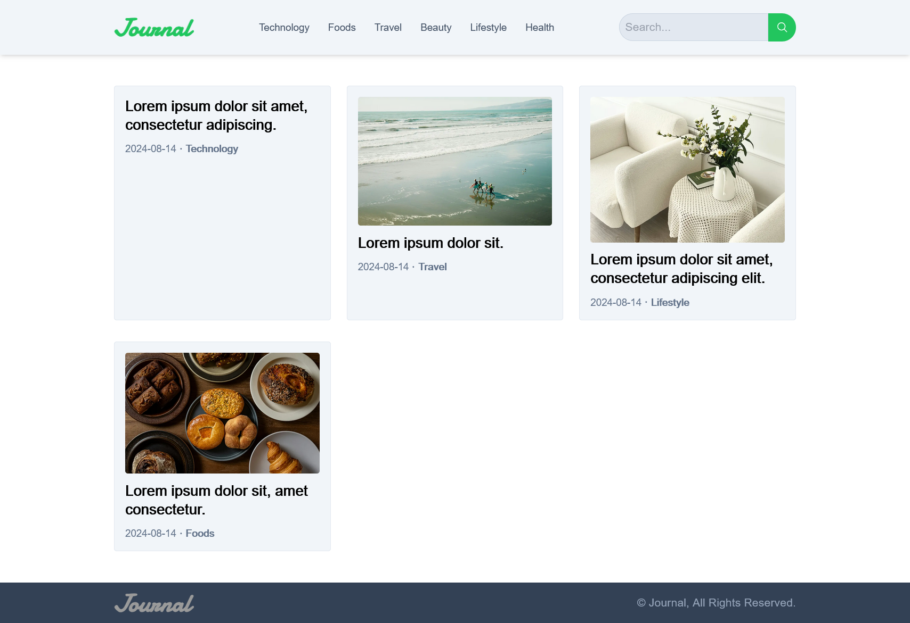
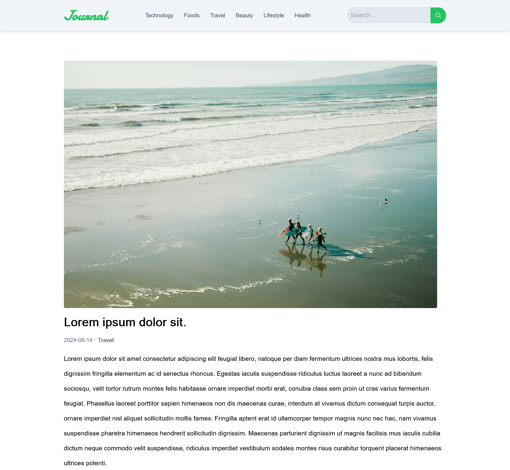
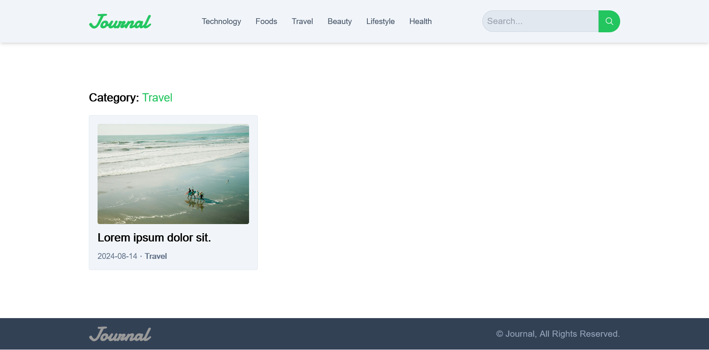

# Journal

A blog made with Django (Back-End) and NextJS (Front-End)

| Previews                                                                                          |
| ------------------------------------------------------------------------------------------------- |
| *Homepage*<br/>                             |
| *Single Post Page*<br/> |
| *Posts by Category Page*<br/>               |

# Back-End

---

## Requirements

- Python 3.11 or higher

---

## Installation

Open `cmd` or `bash` in the project directory.

**Install Python virtual environment**

```bash
pip install virtualenv
```

**Create a virtual environment**

```bash
virtualenv env_name
```

**Activate virtual environment**

On `Mac` and `Linux` (Also if you are using `bash` on `Windows`)

```bash
source env_name/bin/activate
```

On `Windows` (If you are using `cmd`)

```bash
.\env_name\Scripts\activate
```

**Install dependencies**

```bash
pip install -r requirements.txt
```

---

## Environment Variables

To run this project, you will need to create and add the following environment variables to your `.env` file

`DEBUG=True`

`SECRET_KEY=YOUR_SECRET_KEY`

To generate a new secret key

```bash
python manage.py shell -c "from django.core.management.utils import get_random_secret_key; print(get_random_secret_key())"
```

---

## Run Locally

**Migrate database**

```bash
python manage.py makemigrations && python manage.py migrate
```

**Create an admin user**

```bash
python manage.py createsuperuser
```

**Run the `Django` server**

```bash
python manage.py runserver
```

You can access the admin panel at http://127.0.0.1:8000/admin

---

# Front-End

---

## Requirements

- npm >= 10.7.0

- node >= 20.12.2

---

## Environment Variables

You will need to create and add the following environment variables to your `.env` file

`NEXT_PUBLIC_BASE_URL=YOUR_BACKEND_BASE_URL`

---

## Installation

Open `cmd` or `bash` in the project directory.

```bash
npm install
```

## Run Locally

```bash
npm run dev
```

## License

[MIT](https://choosealicense.com/licenses/mit/)
